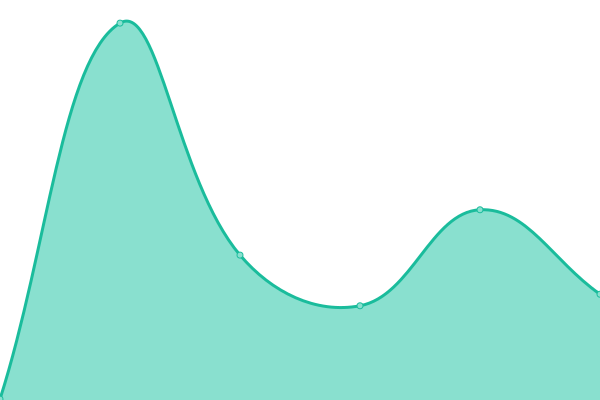
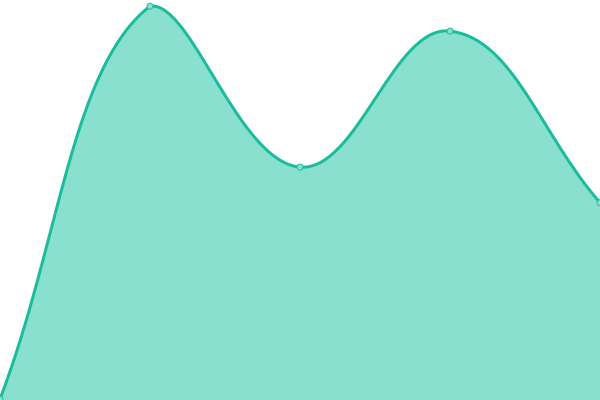

# SeylanHub Uptime Monitor

Uptime monitoring for [SeylanHub](https://seylan-hub.vercel.app) — powered by [Upptime](https://upptime.js.org).

<!--start: status pages-->
<!-- This summary is generated by Upptime (https://github.com/upptime/upptime) -->
<!-- Do not edit this manually, your changes will be overwritten -->
<!-- prettier-ignore -->
| URL | Status | History | Response Time | Uptime |
| --- | ------ | ------- | ------------- | ------ |
|  [SeylanHub Web](https://seylan-hub.vercel.app) | 🟩 Up | [seylan-hub-web.yml](https://github.com/ArdenoStudio/seylan-uptime-monitor/commits/HEAD/history/seylan-hub-web.yml) | 

 143ms
     
 | 

<a href="https://ArdenoStudio.github.io/seylan-uptime-monitor/history/seylan-hub-web">100.00%</a>
    

|  [SeylanHub WWW](https://seylanhub-www.vercel.app) | 🟩 Up | [seylan-hub-www.yml](https://github.com/ArdenoStudio/seylan-uptime-monitor/commits/HEAD/history/seylan-hub-www.yml) | 

 141ms
     
 | 

<a href="https://ArdenoStudio.github.io/seylan-uptime-monitor/history/seylan-hub-www">100.00%</a>
    

|  [Core API](https://seylan-hub-api.fly.dev/health) | 🟩 Up | [core-api.yml](https://github.com/ArdenoStudio/seylan-uptime-monitor/commits/HEAD/history/core-api.yml) | 

 429ms
     
 | 

<a href="https://ArdenoStudio.github.io/seylan-uptime-monitor/history/core-api">100.00%</a>
    

|  [Wallet Service](https://seylan-hub-api.fly.dev/api/wallet/rules/demo_user) | 🟩 Up | [wallet-service.yml](https://github.com/ArdenoStudio/seylan-uptime-monitor/commits/HEAD/history/wallet-service.yml) | 

 411ms
     
 | 

<a href="https://ArdenoStudio.github.io/seylan-uptime-monitor/history/wallet-service">100.00%</a>
    

|  [Loans Service](https://seylan-hub-api.fly.dev/api/loans/demo_user/health) | 🟩 Up | [loans-service.yml](https://github.com/ArdenoStudio/seylan-uptime-monitor/commits/HEAD/history/loans-service.yml) | 

 371ms
     
 | 

<a href="https://ArdenoStudio.github.io/seylan-uptime-monitor/history/loans-service">100.00%</a>
    

|  [Demo Data](https://seylan-hub-api.fly.dev/mock/account-context/demo_user) | 🟩 Up | [demo-data.yml](https://github.com/ArdenoStudio/seylan-uptime-monitor/commits/HEAD/history/demo-data.yml) | 

 335ms
     
 | 

<a href="https://ArdenoStudio.github.io/seylan-uptime-monitor/history/demo-data">100.00%</a>
    

<!--end: status pages-->

## History

<!--start: history pages-->
<!--end: history pages-->
